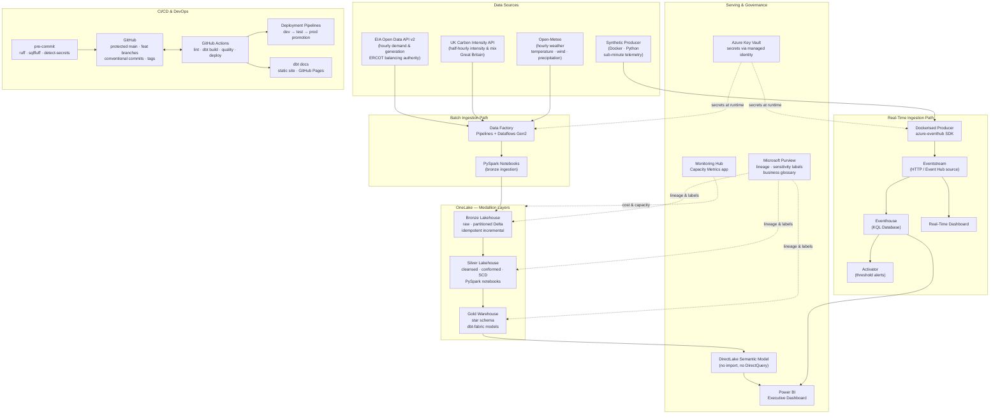

# Architecture — Grid Intelligence Platform

## System Diagram

## Two-Path Summary

| Path | Cadence | Source | Storage | Transforms |
|------|---------|--------|---------|------------|
| Batch | Hourly / twice-daily bulk | EIA, Carbon Intensity history, Open-Meteo | Bronze → Silver → Gold Lakehouse/Warehouse | Data Factory pipelines, PySpark, dbt-fabric |
| Real-time | Sub-minute | Synthetic producer + polled Carbon Intensity | Eventhouse (KQL) | Eventstream, KQL queries, Activator rules |

## Medallion Layers

| Layer | Store | Purpose | Key pattern |
|-------|-------|---------|-------------|
| Bronze | Lakehouse (Delta) | Raw landing, partitioned by `load_date` | Idempotent, append-only, no mutations |
| Silver | Lakehouse (Delta) | Cleansed, conformed, deduplicated, SCDs | PySpark notebooks synced via Git |
| Gold | Warehouse (T-SQL) | Star schema — fact + dimension tables | dbt-fabric; tested; DirectLake-ready |

## Capability to Tool Mapping

| Capability | Primary (Fabric) | Supporting (free) |
|---|---|---|
| Batch ingestion | Data Factory, Dataflows Gen2 | Python — requests, tenacity, pydantic |
| Real-time ingestion | Eventstream (HTTP / Event Hub) | Dockerised Python producer |
| Storage and medallion | OneLake, Lakehouse, Warehouse | Delta, Parquet |
| Real-time storage | Eventhouse (KQL) | KQL queries |
| Transformation | Spark notebooks (silver) | dbt-core + dbt-fabric (gold) |
| Data quality | dbt tests, source freshness | Great Expectations suites |
| Governance and security | Purview hub, labels, RLS, OneLake security | Key Vault for secrets |
| Lineage | Fabric lineage view, Purview | dbt docs lineage graph |
| Orchestration | Data Factory pipelines | Airflow in Docker (portable) |
| Analytics and viz | Power BI DirectLake, Real-Time Dashboard, Activator | — |
| CI/CD | Deployment Pipelines | GitHub Actions |
| Version control | Fabric Git integration | GitHub, pre-commit, semantic tags |
| Documentation | dbt docs site | Theory companion, MkDocs, GitHub Pages |

## Data Sources

| Source | Endpoint | Auth | Cadence | Provides |
|--------|----------|------|---------|---------|
| EIA Open Data API v2 | `https://api.eia.gov/v2/` | Free API key | Hourly | Demand & generation by fuel, ERCOT |
| UK Carbon Intensity API | `https://api.carbonintensity.org.uk/intensity` | None | Half-hourly | Intensity, index, generation mix, GB |
| Open-Meteo | `https://api.open-meteo.com/v1/forecast` | None | Hourly | Temperature, wind, precipitation |
| Synthetic producer | Docker container | n/a | Sub-minute | Simulated smart-meter telemetry |
